# GoHarness 架构设计图

## 📋 总体架构图

```mermaid
graph TB
    subgraph "用户界面层 (User Interface Layer)"
        A[React终端UI] --> B[CLI命令行]
        A --> C[打印模式]
        A --> D[Web界面]
    end
    
    subgraph "应用层 (Application Layer)"
        B --> E[CLI处理器]
        C --> E
        A --> F[UI控制器]
        D --> F
        E --> G[应用协调器]
        F --> G
    end
    
    subgraph "核心服务层 (Core Services Layer)"
        G --> H[AI服务]
        G --> I[工具服务]
        G --> J[会话服务]
        G --> K[插件服务]
        G --> L[权限服务]
        G --> M[状态服务]
    end
    
    subgraph "AI引擎层 (AI Engine Layer)"
        H --> N[查询引擎]
        N --> O[AI API客户端]
        O --> P[Anthropic Claude]
        O --> Q[OpenAI GPT]
        O --> R[其他模型]
        N --> S[记忆管理]
        N --> T[上下文管理]
    end
    
    subgraph "工具系统层 (Tool System Layer)"
        I --> U[工具注册表]
        U --> V[文件工具]
        U --> W[Bash工具]
        U --> X[Web工具]
        U --> Y[搜索工具]
        U --> Z[任务工具]
        U --> AA[MCP工具]
        U --> AB[自定义工具]
    end
    
    subgraph "会话管理层 (Session Management Layer)"
        J --> AC[会话管理器]
        AC --> AD[会话存储]
        AC --> AE[会话历史]
        AC --> AF[会话模板]
        J --> AG[对话管理]
        AG --> AH[消息流]
        AG --> AI[状态同步]
    end
    
    subgraph "插件系统层 (Plugin System Layer)"
        K --> AJ[插件管理器]
        AJ --> AK[认证插件]
        AJ --> AL[权限插件]
        AJ --> AM[工具插件]
        AJ --> AN[钩子插件]
        AJ --> AO[MCP插件]
        K --> AP[插件API]
        AP --> AQ[插件接口]
        AP --> AR[插件生命周期]
    end
    
    subgraph "权限管理层 (Permission Management Layer)"
        L --> AS[权限管理器]
        AS --> AT[权限规则]
        AT --> AU[工具权限]
        AT --> AV[命令权限]
        AT --> AW[路径权限]
        AS --> AX[权限检查]
        AX --> AY[权限验证]
        AX --> AZ[权限拦截]
    end
    
    subgraph "状态管理层 (State Management Layer)"
        M --> BA[状态管理器]
        BA --> BB[状态存储]
        BB --> BC[内存存储]
        BB --> BD[文件存储]
        BB --> BE[数据库存储]
        BA --> BF[状态同步]
        BF --> BG[状态快照]
        BF --> BH[状态恢复]
    end
    
    subgraph "数据持久化层 (Data Persistence Layer)"
        AD --> BI[文件系统]
        BD --> BI
        BB --> BI
        BI --> BJ[JSON存储]
        BI --> BK[SQLite存储]
        BI --> BL[配置文件]
    end
    
    subgraph "外部服务层 (External Services Layer)"
        O --> BM[AI API]
        BM --> BN[Anthropic API]
        BM --> BO[OpenAI API]
        BM --> BP[其他AI服务]
        AA --> BQ[MCP服务器]
        BQ --> BR[外部工具]
        BQ --> BS[外部服务]
    end
    
    subgraph "基础设施层 (Infrastructure Layer)"
        BR --> BT[文件系统]
        BR --> BU[网络服务]
        BR --> BV[进程管理]
        BS --> BW[API网关]
        BS --> BX[消息队列]
        BS --> BY[监控系统]
    end
    
    style A fill:#e1f5fe
    style B fill:#e8f5e8
    style C fill:#fff3e0
    style D fill:#f3e5f5
    style E fill:#fce4ec
    style F fill:#f1f8e9
    style G fill:#e0f2f1
    style H fill:#e8eaf6
    style I fill:#fff8e1
    style J fill:#f3e5f5
    style K fill:#e0f2f1
    style L fill:#fce4ec
    style M fill:#f1f8e9
```

## 🔧 详细组件架构图

### 1. 核心组件关系图

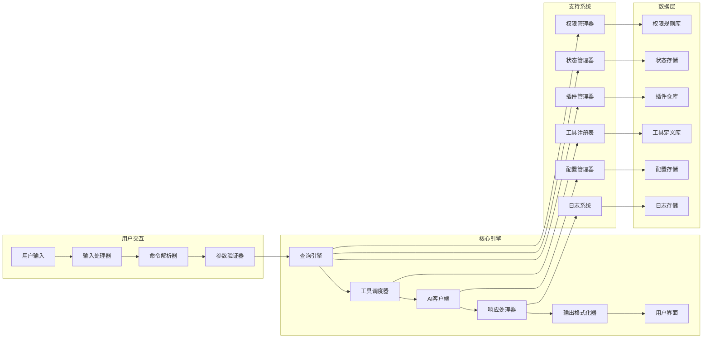

### 2. 工具系统架构图

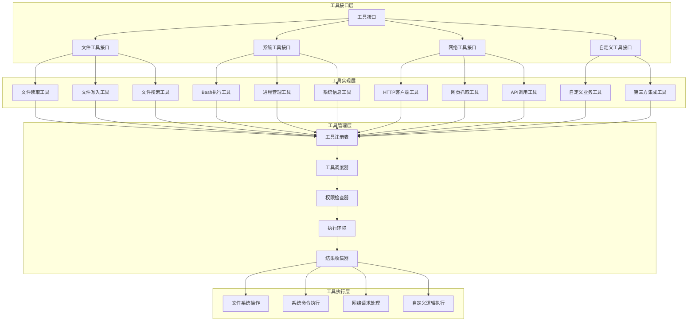

### 3. AI引擎架构图

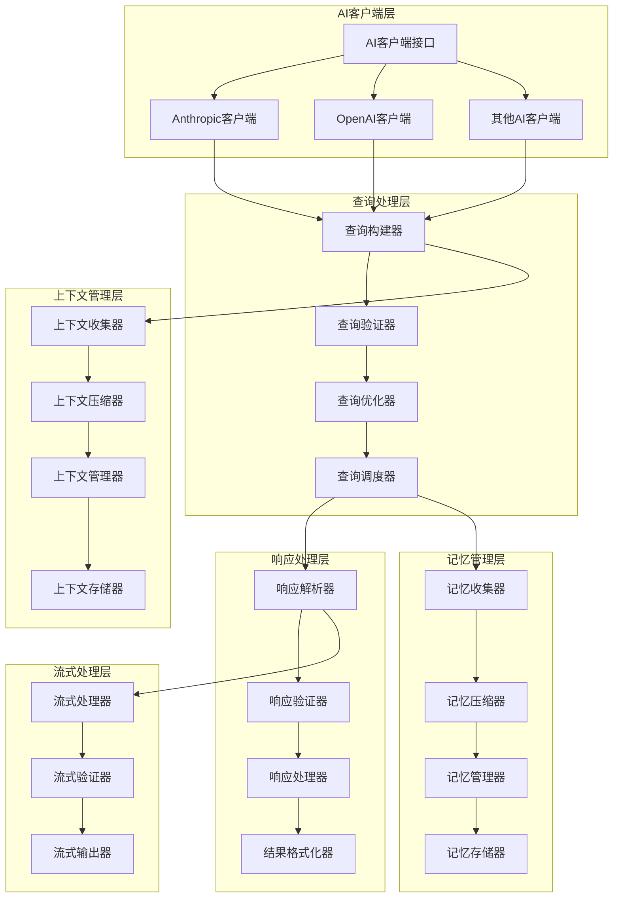

### 4. 权限管理架构图

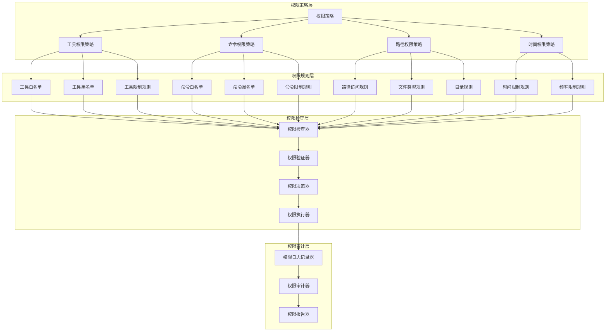

### 5. 插件系统架构图

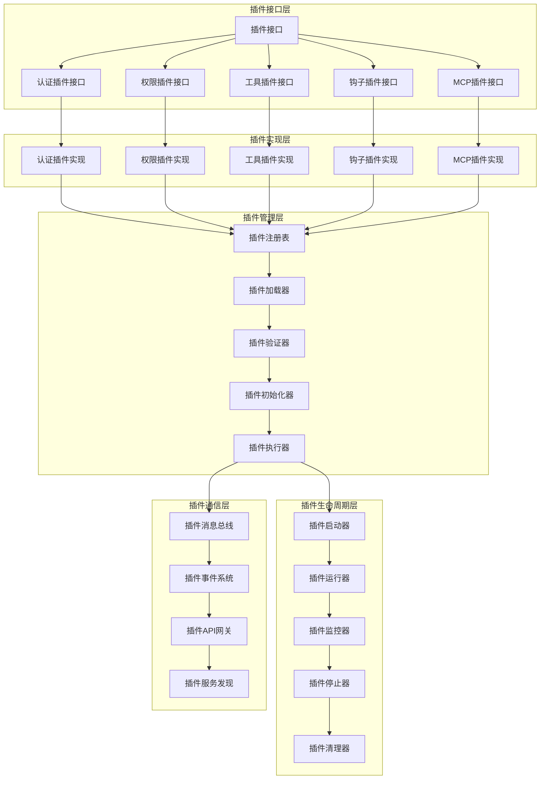

### 6. 状态管理架构图

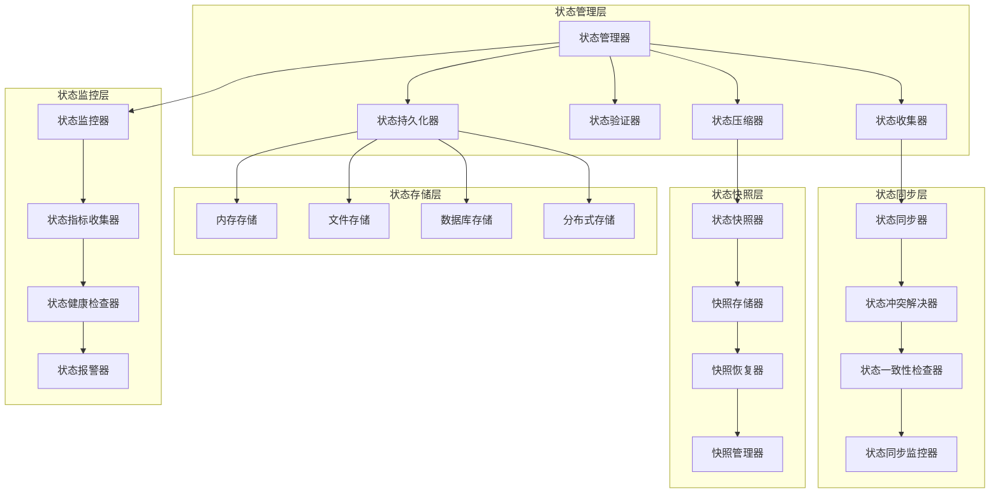

## 🔄 数据流图

### 1. 用户请求处理流程

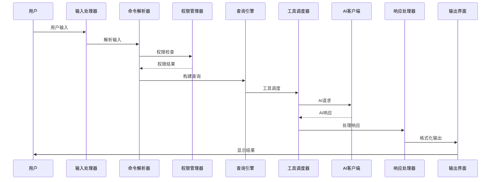

### 2. 工具执行流程

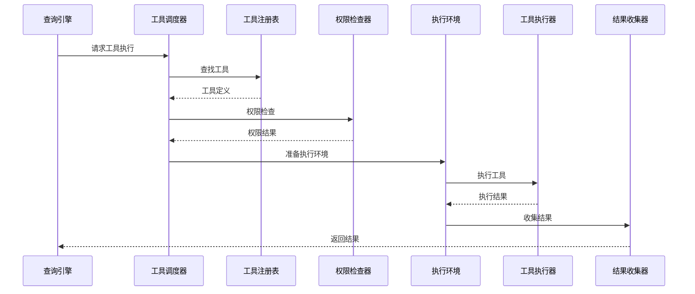

### 3. 插件加载流程

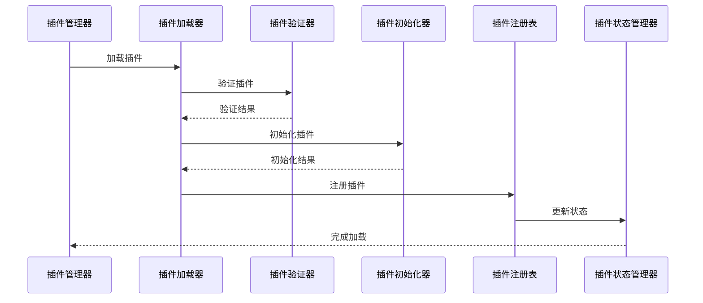

## 📊 系统性能架构图

### 1. 性能监控架构

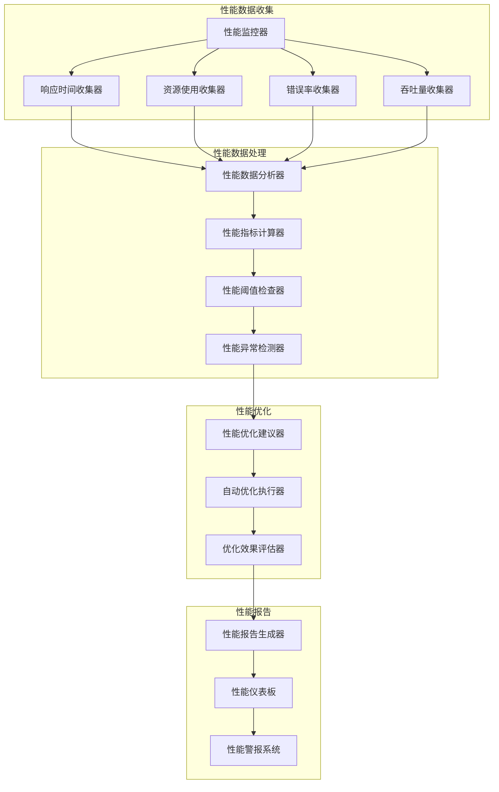

### 2. 缓存架构

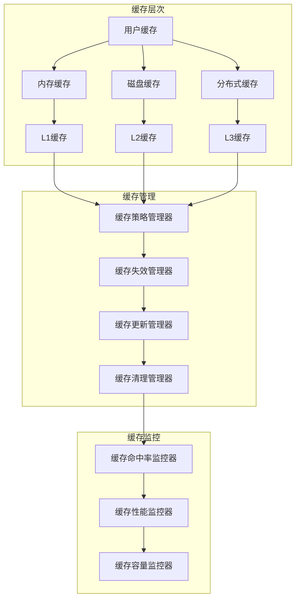

## 🔐 安全架构图

### 1. 安全防护架构

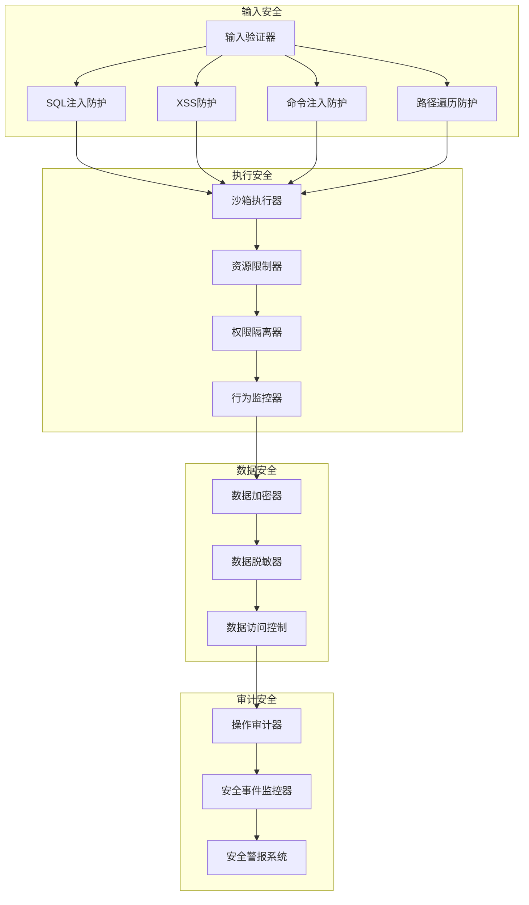

## 🏗️ 部署架构图

### 1. 容器化部署架构

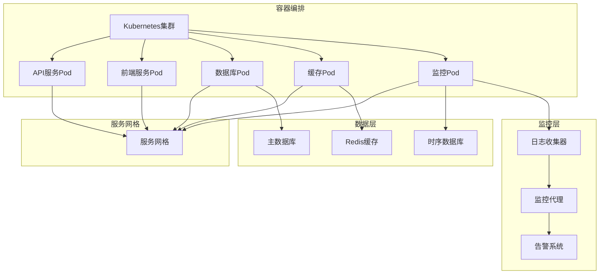

### 2. 微服务部署架构

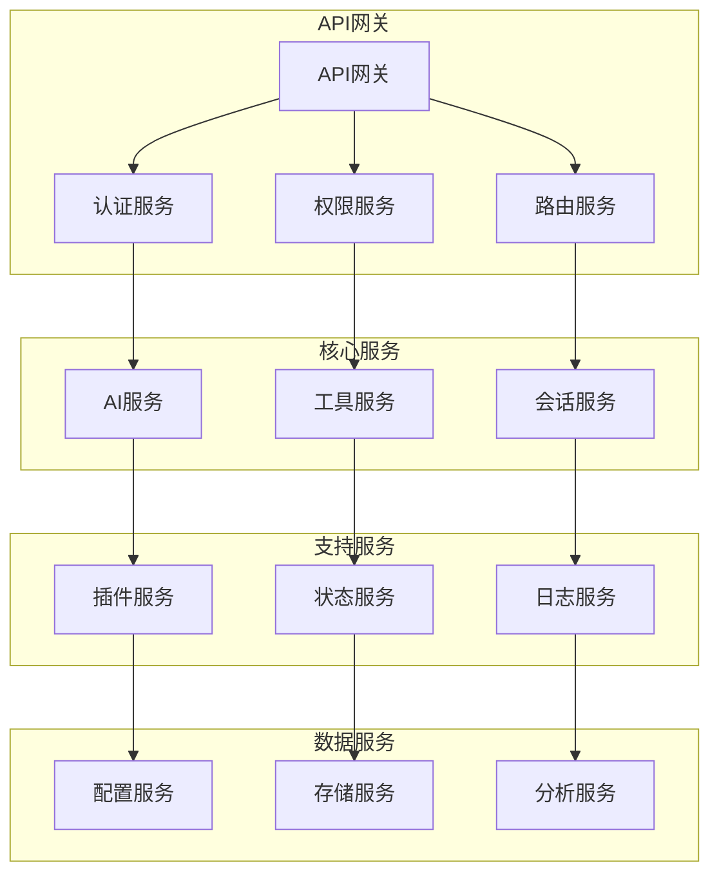

---

## 📝 架构说明

### 设计原则

1. **模块化设计**: 系统采用高度模块化的设计，各个组件职责明确，便于维护和扩展。
2. **可扩展性**: 插件系统和工具系统支持动态扩展，可以轻松添加新功能。
3. **安全性**: 多层次的安全防护机制，确保系统运行安全。
4. **性能优化**: 多级缓存和性能监控，确保系统高效运行。
5. **可维护性**: 完善的日志和监控系统，便于问题排查和维护。

### 技术栈

- **后端**: Go 1.25.6+
- **前端**: React 18.3.1 + TypeScript 5.7.3
- **AI集成**: Anthropic SDK, OpenAI SDK
- **数据库**: SQLite (可扩展为PostgreSQL)
- **缓存**: Redis
- **监控**: Prometheus + Grafana
- **容器化**: Docker + Kubernetes

### 架构优势

1. **高性能**: Go语言的并发特性和优化的架构设计确保系统高性能。
2. **可扩展**: 插件系统和微服务架构支持水平扩展。
3. **易维护**: 清晰的模块划分和完善的监控便于维护。
4. **用户友好**: 多种交互模式满足不同用户需求。
5. **安全可靠**: 多层次的安全防护确保系统安全可靠。

---

*架构设计文档版本: v1.0.0*  
*最后更新: 2026-04-09*